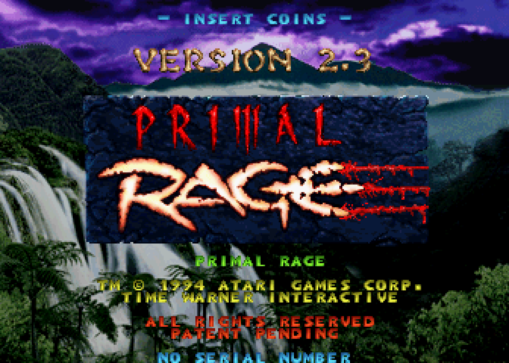
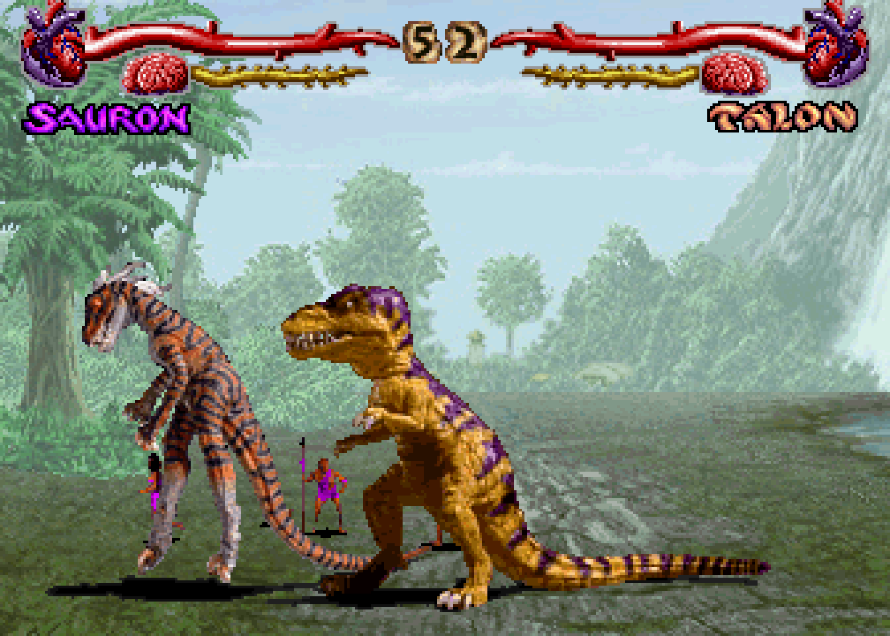

  
  

<h1 align="center">Primal Rage FPGA Core</h1>

  Atari GT arcade hardware for MiSTer FPGA

---

## Overview

FPGA implementation of the Atari GT board running **Primal Rage (1994)**, including the CAGE sound board with its TMS320C31 DSP. The whole game is playable with music, announcer and effects.

---

## Game Information

| Field | Value |
|-------|-------|
| Title | Primal Rage |
| Year | 1994 |
| Developer | Atari Games |
| Genre | Fighting |
| Players | 1-2 simultaneous |

---

## Controls

Default MiSTer gamepad mapping:

| Input | Action |
|-------|--------|
| D-Pad / Joystick | Move |
| Y | High Quick |
| X | High Fierce |
| B | Low Quick |
| A | Low Fierce |
| Select | Insert Coin |
| Start | Start |

---

## Features

- Full CAGE sound: TMS320C31 DSP written from scratch and checked against MAME
- XGA protection chip modelled after MAME
- Settings, high scores and audits saved as NVRAM
- OSD options: aspect ratio, scandoubler, integer scaling, CRT H/V position, volume, service mode

---

## Requirements

An SDRAM module of 32 MB or larger is required. The object and sound ROMs and the sprite frame buffers live in DDR3, so a bigger module is not needed.

---

## ROM Requirements

ROM files are **not included**. The core uses the MAME set `primrage.zip`, Primal Rage (version 2.3, Jan 1995), as of MAME 0.289. The `.mra` lists every file with its CRC and checks the md5 of the assembled ROM.

See the [MiSTer Arcade ROM guide](https://github.com/MiSTer-devel/Main_MiSTer/wiki/Arcade-Roms) for setup.

---

## Installation

1. Copy the `.rbf` from `releases/` to `/_Arcade/cores`.
2. Copy `Primal Rage.mra` from `releases/` to `/_Arcade`.
3. Put `primrage.zip` into `/games/mame`.
4. Start Primal Rage from the Arcade menu.

---

## Saving Settings

Turn on Service Mode in the OSD, change the settings and leave the test menu with the left player's upper right button ("SAVE SETTING AND EXIT"). Then turn Service Mode off and pick Save NVRAM. Autosave is off by default, because the game writes to its EEPROM all the time and the OSD would keep showing "Saving...".

---

## Verification

Some AI tools were used during development. All code went through human review. The test suite lives in my development repository and is not shipped here.

- The sound DSP runs in lockstep against MAME's TMS320C31 core: a million instructions of the real CAGE program plus random instruction stress.
- Unit testbenches (Icarus Verilog) cover video, sprites, protection, the CPU bus, the ROM loader, NVRAM and the CAGE blocks; each has a deliberately broken build that must fail.
- A Verilator simulation runs the game ROM through attract mode and fights, and the sound output is checked against MAME's CAGE model.
- On a DE10-Nano over HDMI and a CRT: long play sessions, service menu, NVRAM saves, continues with the heaviest fighters.

---

## Building

1. Install Quartus Prime Lite 17.0 with Cyclone V support (the DE10-Nano FPGA is a 5CSEBA6U23I7).
2. Open `Arcade-PrimalRage.qpf` and run Processing > Start Compilation, or from the command line: `quartus_sh --flow compile Arcade-PrimalRage`.
3. The bitstream is written to `output_files/Arcade-PrimalRage.rbf`. A full build takes about 30 minutes.
4. `clean.bat` removes the build outputs.

The design is large: about 70% of the logic and 508 of 553 M10K blocks. The release build uses fitter seed 2 (`SEED` in `Arcade-PrimalRage.qsf`) and meets timing on every clock. Other seeds or code changes can move the slack by a few hundred picoseconds, so check the timing report after each build and try another seed if a clock fails.

---

## Legal Notice

This project contains **no copyrighted game data**.

Users are responsible for obtaining and using ROM files in accordance with applicable laws.

Do not request ROM files in issues or discussions.

---

## Credits

FPGA core development: Nortido  
Hardware reference: MAME (Aaron Giles and contributors; Primal Rage protection by Andrea Bogazzi)  
TG68K CPU core: Tobias Gubener  
MiSTer framework: Sorgelig and the MiSTer team  
Original arcade game © 1994 Atari Games

---

## License

GPL-3.0. The MiSTer framework in `sys/` and TG68K keep their own licenses.
